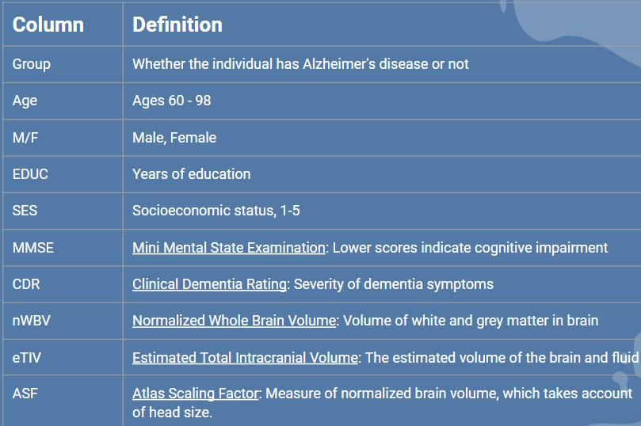
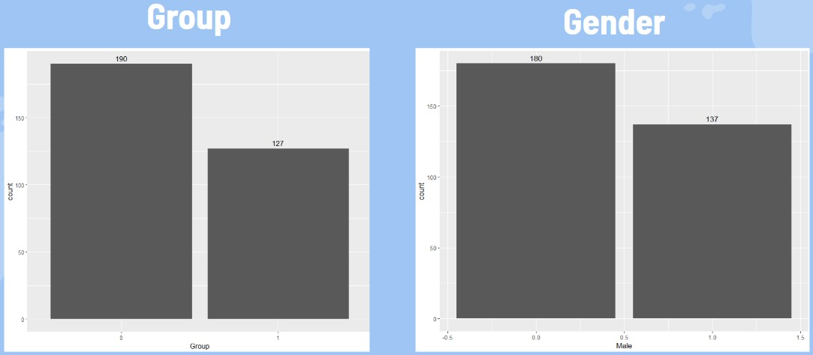
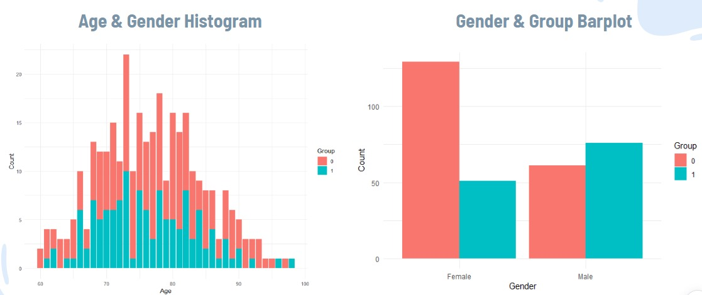
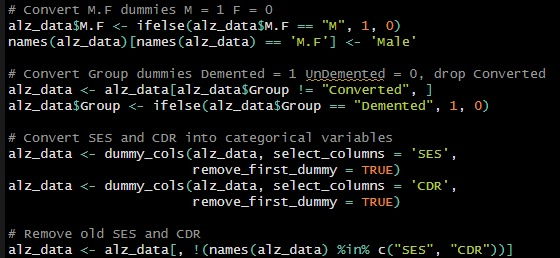
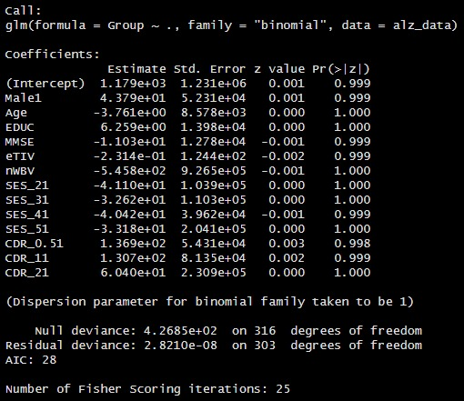

# 📌 Project Background 

Alzheimer’s disease is a brain disorder that impairs an individual’s memory, cognitive functions, and eventually, the ability to perform basic tasks. On a global scale, Alzheimer’s affects 55 million people and is currently ranked as the seventh leading cause of death. The goal of taking on this project is to identify significant predictors of Alzheimer’s and classify who may develop this disease based on various measures. This analysis is important because Alzheimer’s disease impacts individuals on a wide scale. Therefore, these findings will allow us to identify predictors of Alzheimer’s and suggest preventive measures that could slow the progression and perhaps benefit the community. 

### Our project questions include:

What variables are significant predictors of a person who will develop Alzheimer’s disease?

Based on a set of various predictors, can we classify who will/will not develop Alzheimer’s disease?

<i>In collaboration with Zihang (Justin) Sun, Pinhan (Johnny) Tao, Yangky Tanuputra Tan, Janet Tran.</i>

This project uses [Dataset](https://www.kaggle.com/datasets/brsdincer/alzheimer-features) from Kaggle.    
- 373 rows and 10 columns

# 🛠️ Analyzing tools
- R
- Excel

# 📊 Exploratory Data Analysis  
    
      
      
    
      
     
    
      
     

# 👣 Our Approach
Regression analysis traditionally aims to predict the correlation between sobriety and collisions. 
We utilized this approach to maintain a straightforward and precise analysis, providing valuable insights for policymakers and public safety officials. 
By focusing on the continuous relationship between sobriety levels and collision frequencies, we aim to assess the accuracy and performance of the regression models we selected.   

# 🧽 Data Cleaning  
1. Remove the null values from SES and MMSE columns.   
2. Remove “Converted” from the Group column.
    
      
    
3. Convert to binary variables:
   Group (1 == “Demented”, 0 == “Undemented”)
   M/F (1 == “M” , 0 == “F”).
    
      
    
4. Convert to categorical variables:
   SES (SES_2, SES_3, SES_4, SES_5)
5. Remove the CDR variable since CDR is a determinant of whether the patient is demented or not
   
This "cleaned" dataset served as our initial benchmark for subsequent machine-learning experiments.  

# 📈 Statistical Analysis
### Regression Model
- Regression Analysis to predict the correlation between sobriety and collisions:
    
      
      
- This model aims to predict sobriety_encoded, a numerical representation of the party_sobriety categories, using killed_victims and injured_victims as predictors.

# 🔑 Key Takeaways    
1. Logistic regression performs better than decision tree by having a higher accuracy
2. Exercise/meditate and eat fruits/vegetables/fish regularly to moderate the integrity of brain matter
3. Suggest cognitive exams to family/friends/anyone 60+ if you notice signs of memory loss, repetitive questioning, wandering, misplacing items, etc. 
4. Keep an eye on the closed ones who are over age 70 as they get older especially if female

  

# ☁️ Project Improvements  
1. Advanced Analytical Techniques:
   - Utilize machine learning models to predict collision likelihood based on various factors, providing deeper insights into risk patterns.
   - Apply clustering algorithms to identify and analyze collision hotspots, leading to more targeted interventions.

