# 📌 Project Background 

Alzheimer’s disease is a brain disorder that impairs an individual’s memory, cognitive functions, and eventually, the ability to perform basic tasks. On a global scale, Alzheimer’s affects 55 million people and is currently ranked as the seventh leading cause of death. The goal of taking on this project is to identify significant predictors of Alzheimer’s and classify who may develop this disease based on various measures. This analysis is important because Alzheimer’s disease impacts individuals on a wide scale. Therefore, these findings will allow us to identify predictors of Alzheimer’s and suggest preventive measures that could slow the progression and perhaps benefit the community. 

### Our project questions include:

What variables are significant predictors of a person who will develop Alzheimer’s disease?

Based on a set of various predictors, can we classify who will/will not develop Alzheimer’s disease?

---

<i>In collaboration with Zihang (Justin) Sun, Pinhan (Johnny) Tao, Yangky Tanuputra Tan, Janet Tran.</i>

# 🛠️ Analyzing tools
- R (Logistic Regression, Decision Trees, KNN)
- Excel

# 📊 Exploratory Data Analysis  
This project uses [Dataset](https://www.kaggle.com/datasets/brsdincer/alzheimer-features) from Kaggle.    
- 373 rows and 10 columns

    
      
      
   
- 63 more demented observations

- 43 more female observations
   
    
      
     
   
- We can see that there are more 0s in higher age groups than 1s which puts more weight and the false interpretation that aging might decrease the risk of getting this disease.

- In fact, Women have a greater risk of developing dementia during their lifetime. Around twice as many women have Alzheimer's disease – the most common type of dementia – compared to men, according to Alzheimer's Society in the U.K. 
   The main reason for this greater risk is that women live longer than men and old age is the biggest risk factor for this disease. So the coefficient of the Male predictor is also false in real life.

    
      
     

# 👣 Our Approach

1. Data Preparation:
   - Explored and cleaned the dataset, removing null values and converting variables as needed.
   - Conducted Exploratory Data Analysis (EDA) to visualize relationships and identify patterns.
2. Model Development:
   - Logistic Regression:
      - Created models with all variables and with selected significant variables.
      - Applied 10-fold cross-validation for model validation.
   - Decision Trees:
      - Developed initial tree model and applied pruning techniques.
      - Used the rpart method with cross-validation for comparison.
   - K-Nearest Neighbors (KNN):
      - Split data into balanced training sets (200 samples) and testing sets (60 samples).
      - Implemented KNN with k values from 1 to 5.
      - Evaluated each model's accuracy using confusion matrices.
3. Model Evaluation:
   - Evaluated models using accuracy, confusion matrices, and statistical measures.
   - Compared performance of different models and techniques.
4. Interpretation and Conclusions:
   - Identified significant predictors of Alzheimer's disease.
   - Drew conclusions and provided recommendations based on our findings.

# 🧽 Data Cleaning  
1. Remove the null values from the SES and MMSE columns.   
2. Remove “Converted” from the Group column.
3. Convert to binary variables:
   Group (1 == “Demented”, 0 == “Undemented”)
   M/F (1 == “M” , 0 == “F”).
4. Convert to categorical variables:
   SES (SES_2, SES_3, SES_4, SES_5)
5. Remove the CDR variable since CDR is a determinant of whether the patient is demented or not

    
      
    
   
This "cleaned" dataset served as our initial benchmark for subsequent machine-learning experiments.  

# ✏️ Machine Learning Models
### Logistic Regression
- Model1: all variables in our Logistic Regression model

    
      
    
- Coefficients: The coefficients for all predictors are extremely high, indicating possible issues with the model.
- P-values: All predictors have p-values close to 1, indicating none of the predictors are significant.
- Deviance:
   - Null deviance: 426.85
   - Residual deviance: 2.8210e-08
- AIC: 28

***
- Model2: We selected some significant variables in our Logistic Regression model

    
      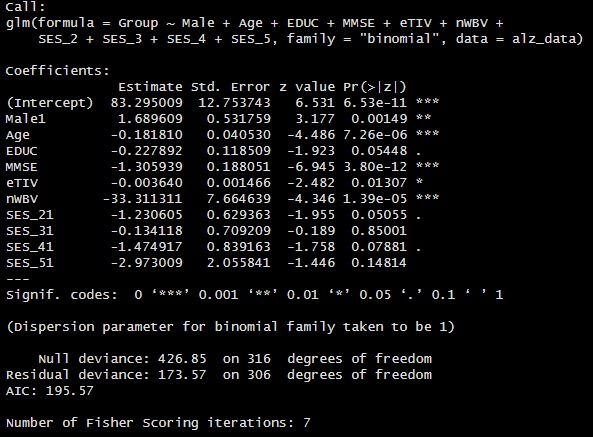
    
   
- Coefficients: The coefficients appear more reasonable.
- P-values: Several predictors are significant:
   - Male1, Age, MMSE, eTIV, and nWBV have p-values < 0.05.
   - EDUC, SES_2, and SES_4 have p-values close to 0.05.
- Deviance:
   - Null deviance: 426.85
   - Residual deviance: 173.57
- AIC: 195.57
***
#### Comparison:

Significance of Predictors: Model 2 has several predictors that are statistically significant, while Model 1 has none.
Deviance: Both models have the same null deviance, but Model 2 has a much higher residual deviance compared to Model 1. However, Model 1's residual deviance being close to zero suggests overfitting.
AIC: Model 1 has a significantly lower AIC (28) compared to Model 2 (195.57). However, this alone isn't enough to declare it a better model, especially considering the likely overfitting in Model 1.
   
    
      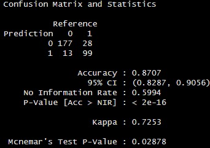
    

- We used Model2 as our final Logistic Regression Model, and used 10-fold Cross Validation
- The coefficient indicates that most variables influence the dependent variable in a negative direction.
- Male and Age coefficients are wrong when compared to reality
- Cross Validation technique
- Accuracy rate: 87.1%

    
      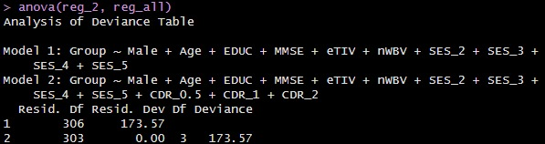
      

***
  
### Decision Trees
- MMSE is the primary split
- The tree seems overfitting due to excessive branching, which results in redundancy in some nodes. E.g. node of nWBV < 0.747 has the same results as 0
- Accuracy rate: 93.06%

    
      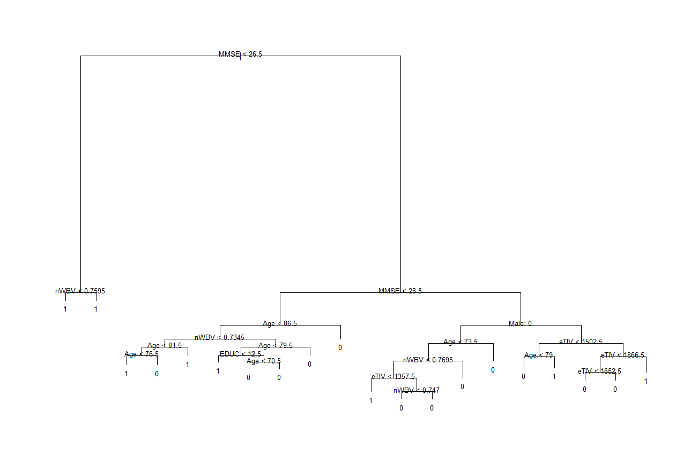
    
    
      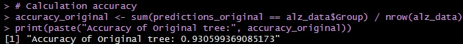
    

### Decision Trees (Pruned)
- By plotting prune1$size on the x-axis and prune1$dev on the y-axis, we can visualize how the complexity of the tree (in terms of the number of terminal nodes) impacts its deviation

`plot(prune1$size, prune1$dev, xlab = "Size of Tree", ylab = "Deviation")`

- As we can see the relation between size and misclass. When the size is 5, the misclassification rate is 40%. However, as the size approaches 16, the misclassification rate decreases to approximately 22%. Therefore, we select 16 as the optimal size since the misclassification rate no longer decreases.
    
      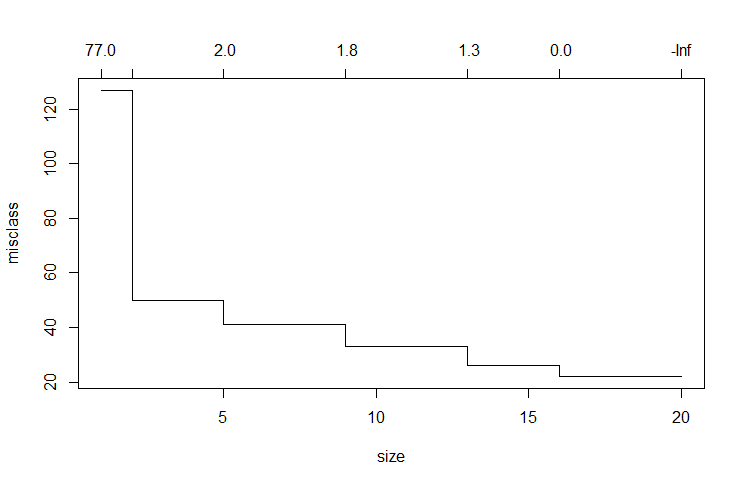
    
- This is a more accurate and precise prune tree
    
      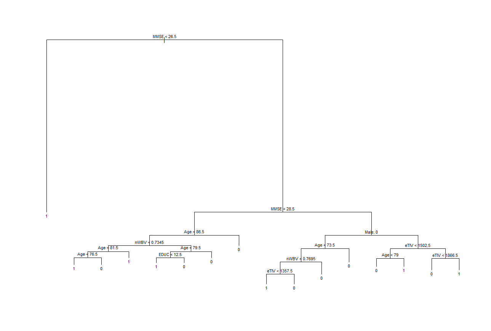
    
    
      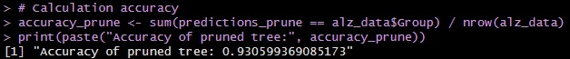
    

- We used the `rpart` method and the `train` function from the `caret` package

`fit_tree <- train(Group ~  Male + Age + EDUC + MMSE + eTIV + nWBV
             + SES_2 + SES_3 + SES_4 + SES_5, data = alz_data, method = "rpart", 
            trControl = ctrl)`
  
- MMSE is still the primary split
- Having no repeated branches and clear separation in each branch indicates that the model is effectively partitioning the data based on the selected variables.
- Accuracy rate: 85.49%

    
      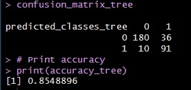
    

***
### K-Nearest Neighbors (KNN)
- In the KNN algorithm, we ran from k=1 to k=5 to see which has the highest accuracy
    
      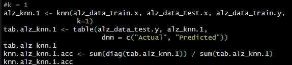
    

- The results are
    
      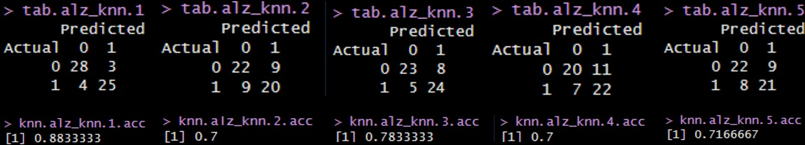
    

# 🔑 Key Takeaways    
1. Logistic regression performs better than decision tree by having a more accurate classification
2. Exercise/meditate and eat fruits/vegetables/fish regularly to moderate the integrity of brain matter
3. Suggest cognitive exams to family/friends/anyone 60+ if you notice signs of memory loss, repetitive questioning, wandering, misplacing items, etc. 
4. Keep an eye on the closed ones who are over age 70 as they get older especially if female

  

# ☁️ Project Improvements  
1. Advanced Modeling Techniques:
   - Implement more sophisticated models like Random Forests or Neural Networks.
   - Explore ensemble methods to combine multiple models' strengths.
2. Robust Validation:
   - Implement more advanced cross-validation strategies.
   - Validate the model on external datasets to assess generalizability

# 🔗 Reference
- 2020 Alzheimer’s Disease Facts and Figures - 2020 - Alzheimer’s ..., https://alz-journals.onlinelibrary.wiley.com/toc/15525279/2020/16/3
- "Alzheimer’s Disease Facts and Figures." Alzheimer’s Disease and Dementia, https://www.alz.org/alzheimers-dementia/facts-figures
- "Dementia vs. Alzheimer’s Disease: What Is the Difference?" Alzheimer’s Disease and Dementia, www.alz.org/alzheimers-dementia/difference-between-dementia-and-alzheimer-s
- Dincer, Baris. "Alzheimer Features." Kaggle, 30 Mar. 2021, www.kaggle.com/datasets/brsdincer/alzheimer-features
